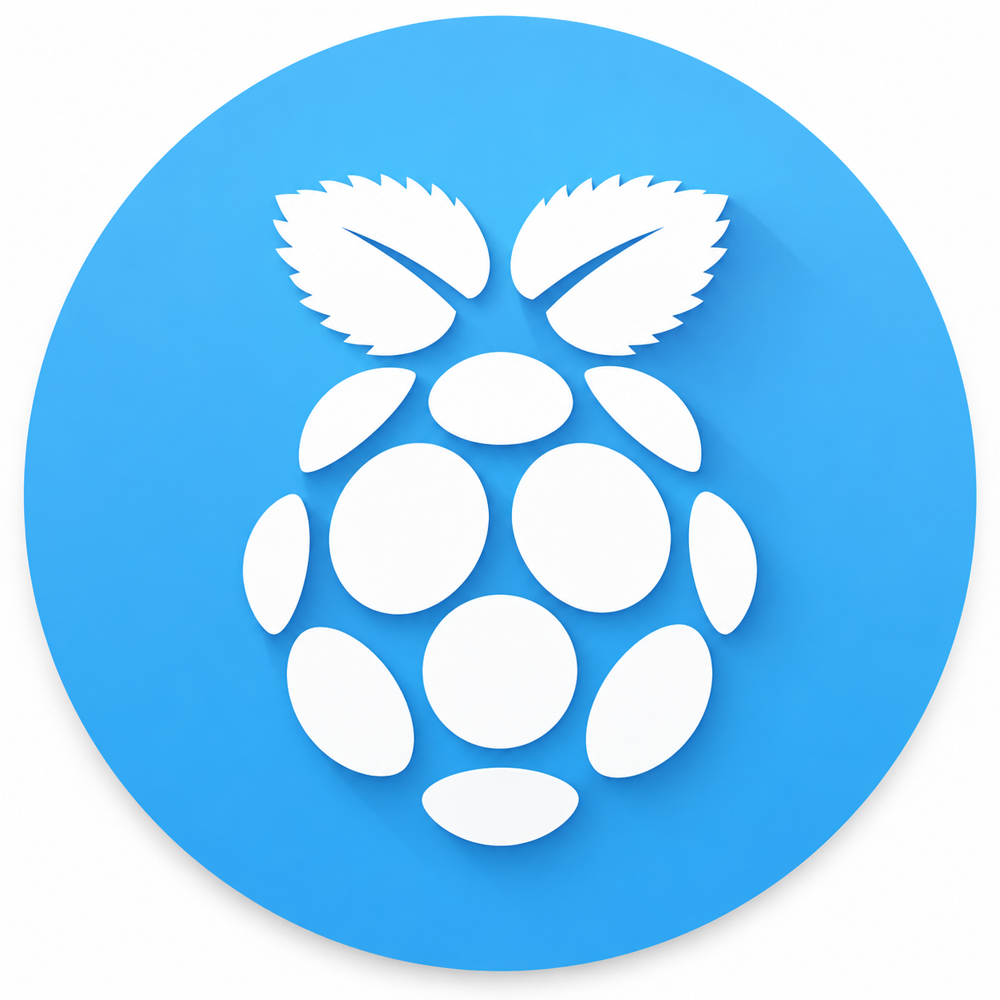
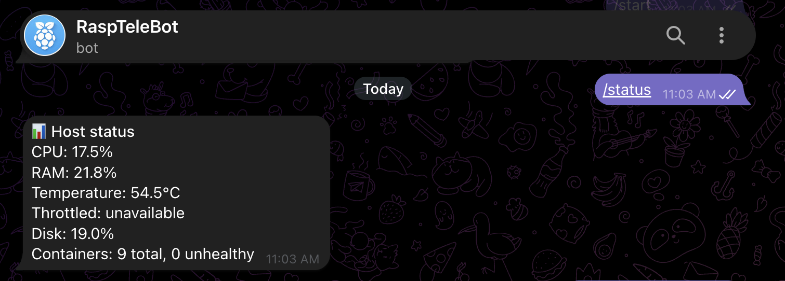
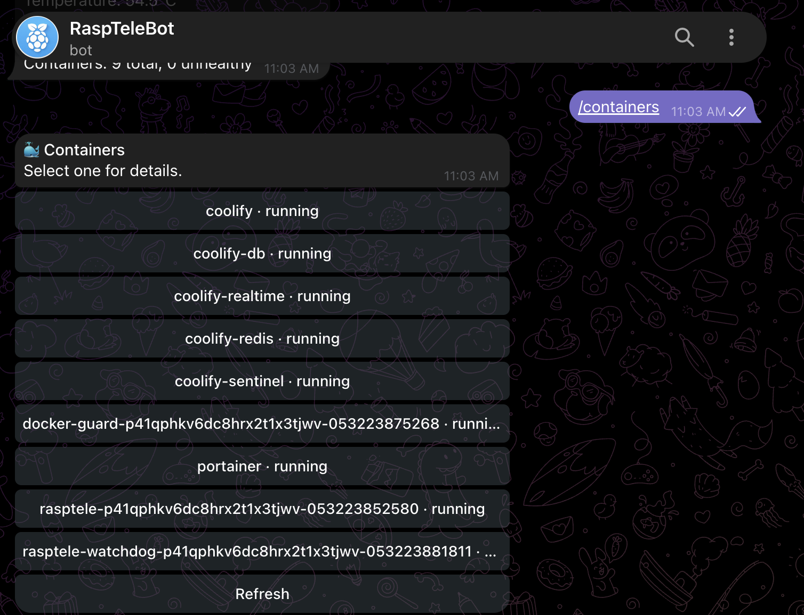

<p align="center">
  
</p>

# Rasptele

Rasptele is a private Telegram control plane for a Raspberry Pi Docker server. It lets one trusted Telegram account monitor host and container health, receive alerts, and restart explicitly approved containers—without exposing an inbound port.

## What it does today

Rasptele v1 provides:

- Outbound-only Telegram long polling; the supplied Compose stack publishes no ports.
- Single-user access control using a numeric Telegram user ID, restricted to that user's private chat.
- `/status` for host CPU, RAM, disk, temperature, throttling, and container-health summary.
- `/containers` for every Docker container, with a restart control only for configured names.
- Stateful alerts for disk usage, CPU temperature, throttling, stopped containers, unhealthy containers, and Docker guard outages.
- Durable alert delivery: unsent Telegram notifications remain in a SQLite outbox for retry.
- An independent watchdog that can report failure of the main bot or Docker guard.
- A confirmation button that is bound to your Telegram ID, expires after 60 seconds, and can be used once.
- `/audit` for the latest local incident and action records.

Pi-hole, qBittorrent, Jellyfin, Coolify, and OpenWrt integrations are not implemented yet.

<p align="center">
  
</p>

<p align="center">
  
</p>

## Choose a deployment method

Rasptele always runs the same three services. Choose the deployment method that matches how you manage Docker on the Raspberry Pi:

| Method | Source | Compose file | Use when |
| --- | --- | --- | --- |
| Plain Docker Compose | Local Git checkout and local build | `compose.yaml` | You manage the Pi over SSH. |
| Coolify | Git repository and Coolify build | `compose.coolify.yaml` | Coolify manages deployments from Git. |
| Portainer | Released image from GHCR | `compose.portainer.yaml` | Portainer manages stacks and image updates. |

All methods require Docker on a 64-bit Raspberry Pi, outbound access to Telegram, and the same BotFather token and numeric Telegram user ID. None publishes an inbound port.

## Create the Telegram credentials

These steps target a Raspberry Pi 5 running a 64-bit Linux distribution with Docker Engine and the Docker Compose plugin.

1. In Telegram, open `@BotFather`, run `/newbot`, and save the token it gives you.
2. Send a message to your new bot. It will not reply until Rasptele is deployed, but Telegram will record the update.
3. Query Telegram for the message you sent, replacing the placeholder with the BotFather token:

   ```sh
   curl -s "https://api.telegram.org/bot<TELEGRAM_BOT_TOKEN>/getUpdates"
   ```

4. Find `message.from.id` in the response. Save that positive integer as `TELEGRAM_ALLOWED_USER_ID`.

The BotFather token is `TELEGRAM_BOT_TOKEN`. Its numeric prefix identifies the bot, so Rasptele does not require a separate bot ID.

## Deploy with plain Docker Compose

Use this path when you manage the Pi over SSH and want Docker to build the image from a local checkout.

### Clone and configure the repository

```sh
git clone https://github.com/maddhruv/rasptele.git
cd rasptele
cp .env.example .env
chmod 600 .env
cp config.example.yaml config.yaml
```

Edit `.env`:

```dotenv
TELEGRAM_BOT_TOKEN=123456789:replace-with-your-token
TELEGRAM_ALLOWED_USER_ID=123456789
```

Keep `.env` private. It is ignored by Git and Docker build contexts and must never be committed.

Edit `config.yaml`. Rasptele shows every container, but only exact names in the restart allowlist receive a restart button:

```yaml
containers:
  restart_allowed:
    - pihole
    - jellyfin
```

List the exact names on the Pi:

```sh
docker ps --format '{{.Names}}'
```

### Start the stack

```sh
docker compose up -d --build
docker compose ps
docker compose logs -f rasptele
```

Confirm that `rasptele`, `docker-guard`, and `rasptele-watchdog` remain running. Send `/start` to the bot in a private chat, then run `/status`.

To update a source checkout later, pull the revision you intend to deploy and rebuild:

```sh
git pull
docker compose up -d --build
```

## Deploy with Coolify

Deploy the Git repository as a **Docker Compose** resource on the Raspberry Pi that Rasptele will manage. Use `compose.coolify.yaml`; its `build: .` entries make Coolify build the image from the selected Git revision. The `image:` values name the resulting local images and do not require GitHub Container Registry (GHCR) access.

This is the recommended deployment path because Rasptele requires three services, host mounts, the Docker socket, runtime secrets, and persistent storage. A standalone container image does not describe those resources.

Before deploying, commit and push `compose.coolify.yaml` and the revision you intend Coolify to run. Connect the repository through the Coolify GitHub App and enable automatic deployments if pushes to `main` should redeploy Rasptele.

### Create the persistent configuration on the Pi

Create the configuration directly on the Pi:

```sh
sudo install -d -m 700 /opt/rasptele
sudo install -m 600 /dev/null /opt/rasptele/config.yaml
sudo editor /opt/rasptele/config.yaml
```

Copy the contents of `config.example.yaml` into that file and adjust the container restart allowlist. Keep `docker_guard_url` set to `http://docker-guard:8080`.

### Configure the Coolify resource

Create the resource with these values:

- Repository: this GitHub repository.
- Branch: `main`.
- Compose file: `/compose.coolify.yaml`.
- Destination server: the Raspberry Pi.
- Runtime variables: `TELEGRAM_BOT_TOKEN` and `TELEGRAM_ALLOWED_USER_ID`.

Keep both Telegram values runtime-only. Do not assign a domain or publish a port for any service. Deploy only on a dedicated, trusted Pi because the stack reads host metrics and `docker-guard` controls allowlisted containers through the Docker socket.

The Coolify Compose file keeps `/var/run/docker.sock` exclusive to `docker-guard`, mounts host metrics read-only into `rasptele`, and persists SQLite data in `rasptele-data`. Keep these service boundaries intact.

After deployment, confirm that `rasptele`, `docker-guard`, and `rasptele-watchdog` remain running. Open the `rasptele` logs in Coolify, then send `/start` and `/status` to the bot in a private Telegram chat.

## Deploy with Portainer

Use `compose.portainer.yaml` to deploy the released multi-architecture image from GitHub Container Registry (GHCR). Portainer does not build the source repository in this path.

The package currently rejects anonymous pulls. Before creating the stack, choose one of these access methods:

- Make the `rasptele` package public in the GitHub package settings.
- In Portainer, open **Registries**, add `ghcr.io`, and authenticate with your GitHub username and a personal access token that has `read:packages` permission.

### Create the persistent configuration on the Pi

Create the configuration on the Docker host before Portainer creates the stack:

```sh
sudo install -d -m 700 /opt/rasptele
sudo install -m 600 /dev/null /opt/rasptele/config.yaml
sudo editor /opt/rasptele/config.yaml
```

Copy the contents of `config.example.yaml` into that file and adjust the container restart allowlist. Keep `docker_guard_url` set to `http://docker-guard:8080`.

### Create the Portainer stack

1. Open **Stacks**, then select **Add stack**.
2. Select **Repository** as the build method.
3. Set the repository URL to `https://github.com/maddhruv/rasptele`.
4. Set the repository reference to `refs/heads/main`.
5. Set the Compose path to `compose.portainer.yaml`.
6. Add these environment variables:

   ```dotenv
   TELEGRAM_BOT_TOKEN=123456789:replace-with-your-token
   TELEGRAM_ALLOWED_USER_ID=123456789
   ```

7. Deploy the stack without publishing ports.

Portainer pulls `ghcr.io/maddhruv/rasptele:0.1.0` for all three services. Confirm all three containers remain running, inspect the `rasptele` logs, and test `/start` and `/status`.

To deploy a newer release, update the three `image:` tags in `compose.portainer.yaml`, commit the change, and redeploy or pull and recreate the stack in Portainer.

## Publish a GHCR release

Coolify and plain Docker Compose build from source, so neither requires a published image. Portainer uses the released image. GitHub Actions publishes ARM64 and AMD64 images when a version tag matching `v*` is pushed:

```sh
git tag v0.1.0
git push origin main v0.1.0
```

For `v0.1.0`, the workflow publishes these tags:

```text
ghcr.io/maddhruv/rasptele:0.1.0
ghcr.io/maddhruv/rasptele:0.1
ghcr.io/maddhruv/rasptele:v0.1.0
```

The image does not replace the Compose definition. Every deployment still needs the same three services, mounts, secrets, and persistent volume.

## Use Rasptele from Telegram

| Command | Result |
| --- | --- |
| `/start` or `/help` | Confirms the bot is online and lists the available commands. |
| `/status` | Shows CPU, RAM, disk, temperature, throttling, and container-health summary. |
| `/containers` | Opens the container picker. Select a container for its state, health, image, and restart count. |
| `/audit` | Shows the ten most recent local audit records. |

For an allowlisted container, select **Restart**, then select **Confirm restart** within 60 seconds. A confirmation is valid only for your configured user ID and cannot be reused. A container outside `restart_allowed` has no restart control.

Commands outside the configured user's private chat are ignored. The attempt is recorded locally without a reply.

## Configuration reference

`config.yaml` is non-secret and is mounted read-only into all three services.

| Key | Default | Description |
| --- | --- | --- |
| `database_path` | `/data/rasptele.sqlite3` | SQLite path for alerts, confirmations, and audit data. |
| `monitor_interval_seconds` | `60` | Seconds between full host and Docker reconciliation checks. Must be positive. |
| `reminder_interval_minutes` | `30` | Minutes between reminders for an active alert. Must be positive. |
| `audit_retention_days` | `90` | Days to retain audit records and resolved incidents. Must be positive. |
| `alerts.disk_percent` | `90` | Alert when host disk usage reaches this percentage. Must be greater than 0 and at most 100. |
| `alerts.temperature_celsius` | `80` | Alert when the Pi thermal-zone temperature reaches this value. Must be positive. |
| `containers.restart_allowed` | `[]` | Exact Docker container names that may be restarted after confirmation. |
| `docker_guard_url` | `http://docker-guard:8080` | Internal Docker guard URL. Do not expose it publicly. |

The bot reads these required environment variables from `.env`, Coolify, or Portainer:

| Variable | Description |
| --- | --- |
| `TELEGRAM_BOT_TOKEN` | Token created with BotFather. |
| `TELEGRAM_ALLOWED_USER_ID` | Positive numeric Telegram user ID permitted to use the bot. |

Rasptele fails closed and does not begin Telegram polling if a required secret is missing, the user ID is not numeric, or the YAML configuration is invalid.

## Alerts and monitoring

Rasptele subscribes to Docker container events and also reconciles state on the configured interval. It opens an alert on the first failing observation, sends reminders while it remains active, and sends a recovery message when it clears. Notifications are acknowledged only after Telegram accepts them; failures remain in the durable outbox for retry.

The current alert conditions are:

- Host disk usage at or above `alerts.disk_percent`.
- CPU temperature at or above `alerts.temperature_celsius` when the Pi thermal-zone sensor is available.
- A Raspberry Pi throttling or under-voltage signal when the firmware sysfs value is available.
- A container that is not running or reports Docker health status `unhealthy`.
- An unavailable Docker guard.
- The main bot container being down, reported independently by `rasptele-watchdog`.

The host temperature and throttling fields appear as `unavailable` when the host does not expose the expected Raspberry Pi sysfs paths.

## Operate and troubleshoot

### Inspect services and logs

```sh
docker compose ps
docker compose logs -f rasptele
docker compose logs -f docker-guard
```

### Validate configuration without starting the stack

The bot exits with a `configuration error` when its secret or YAML validation fails. Confirm the files exist and contain the required values:

```sh
test -f .env && test -f config.yaml && echo "configuration files found"
docker compose config
```

### Back up audit and alert history

The named `rasptele-data` volume contains the SQLite database. Stop the stack before taking a consistent volume backup:

```sh
docker compose down
docker run --rm -v rasptele_rasptele-data:/data -v "$PWD:/backup" alpine \
  tar czf /backup/rasptele-data-backup.tgz -C /data .
docker compose up -d
```

The volume name above is Docker Compose's default for this repository. Confirm it first with `docker volume ls` if you changed the Compose project name.

### Common problems

| Symptom | Check |
| --- | --- |
| Bot does not reply | Verify the token and user ID, then inspect `docker compose logs rasptele`. The bot ignores any user ID other than `TELEGRAM_ALLOWED_USER_ID`. |
| `Docker guard is unavailable` alert | Confirm `docker-guard` is running and has access to `/var/run/docker.sock`. Inspect its logs. |
| No temperature or throttling reading | Confirm this is a supported Raspberry Pi Linux host and that the read-only `/sys` mount remains in the Compose file. |
| No restart button | Confirm the exact Docker container name is in `containers.restart_allowed`, then redeploy after editing `config.yaml`. |

## Security model

Rasptele is designed to keep the bot's authority narrow, but it still operates close to the host. Review the deployment before using it on a server with sensitive workloads.

- The `rasptele` bot has no Docker socket mount. `docker-guard` is the only service with that socket.
- The guard exposes only sanitized container status, sanitized container lifecycle events, and restart for names in the configured allowlist. It does not expose generic Docker API routes.
- The bot requires a configured Telegram user ID and private chat and silently rejects every other context.
- Every v1 restart requires a second, single-use confirmation that expires after 60 seconds.
- Rasptele mounts host `/proc`, `/sys`, and `/` read-only to collect real host metrics. Read-only access to `/` is still sensitive; do not broaden these mounts or expose the stack to an untrusted network.
- The stack defines no inbound ports. Telegram communication uses outbound long polling; the watchdog only sends outbound messages.

See [SECURITY.md](SECURITY.md) for vulnerability reporting.

## Project layout

```text
src/rasptele/       Bot, monitoring, watchdog, configuration, SQLite store, and Docker guard
compose.yaml        Three-service local production deployment
compose.coolify.yaml Coolify deployment using persistent host configuration
compose.portainer.yaml Portainer deployment using the released GHCR image
config.example.yaml Reviewable non-secret configuration template
.env.example        Secret environment-variable template
tests/              Configuration, incident, and confirmation tests
```

## Development and verification

Rasptele requires Python 3.11 or newer for local development.

```sh
python -m pip install . ruff mypy
ruff check src tests
mypy --ignore-missing-imports src
python -m unittest discover -s tests -v
docker build -t rasptele:local-test .
```

GitHub Actions runs linting, type checks, tests, a container build, and an image vulnerability scan. Tagged releases publish ARM64 and AMD64 images to GitHub Container Registry.

## License

Rasptele is licensed under the [Apache License 2.0](LICENSE).
