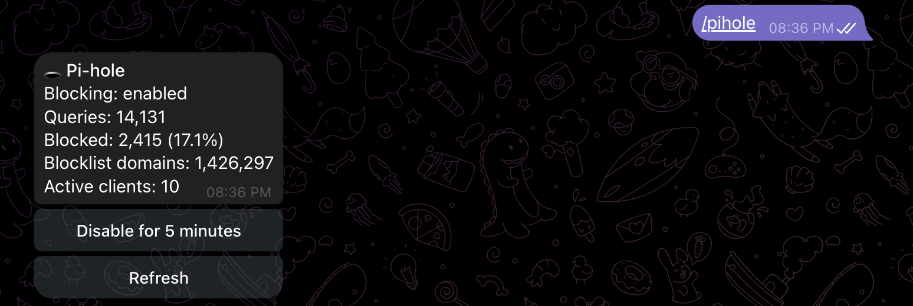

<p align="center">
  
</p>

# Rasptele

Rasptele is a private Telegram control plane for monitoring and managing a Raspberry Pi Docker server without exposing an inbound port.

[](https://github.com/maddhruv/rasptele/actions/workflows/ci.yml)
[](LICENSE)
[](https://www.python.org/)

Rasptele gives one trusted Telegram account a narrow interface to host health, Docker containers, and Pi-hole v6. It runs as three containers, keeps the Docker socket isolated in an allowlisted guard service, and delivers alerts through outbound Telegram long polling.

## What Rasptele does

- Reports CPU, memory, disk, temperature, throttling, and container health with `/status`.
- Lists Docker containers and restarts only explicitly allowlisted names after confirmation.
- Reports Pi-hole v6 statistics and can temporarily disable or immediately restore blocking.
- Sends stateful alerts for host, container, Docker guard, watchdog, and Pi-hole failures.
- Retries unsent Telegram notifications from a durable SQLite outbox.
- Records recent incidents and actions for `/audit`.
- Restricts commands and confirmations to one numeric Telegram user ID in a private chat.

qBittorrent, Jellyfin, Coolify API, and OpenWrt integrations are not implemented.

## Quick start

You need:

- A 64-bit Raspberry Pi with Docker Engine and the Docker Compose plugin.
- A Telegram account.
- Outbound access from the Raspberry Pi to Telegram and GitHub Container Registry.

### 1. Create your Telegram bot

1. Open [`@BotFather`](https://t.me/BotFather) in Telegram.
2. Send `/newbot` and follow the prompts.
3. Save the bot token. Treat it like a password.
4. Open your new bot and send it any message.

### 2. Find your Telegram user ID

1. Open [`@userinfobot`](https://telegram.me/userinfobot) in Telegram.
2. Select **Start**.
3. Copy the positive number shown next to `Id`. This is your `TELEGRAM_ALLOWED_USER_ID`.

### 3. Download an exact release

Wait for the [v0.3.0 release workflow](https://github.com/maddhruv/rasptele/actions/workflows/release.yml) to pass, then run:

```bash
git clone --branch v0.3.0 --depth 1 https://github.com/maddhruv/rasptele.git
cd rasptele
cp .env.example .env
chmod 600 .env
```

Using an exact release tag keeps the Compose definition and container image on the same version.

### 4. Add the required credentials

Open `.env` and set these two values:

```dotenv
TELEGRAM_BOT_TOKEN=<TELEGRAM_BOT_TOKEN>
TELEGRAM_ALLOWED_USER_ID=<TELEGRAM_ALLOWED_USER_ID>
```

Leave the remaining variables at their defaults for your first deployment. You do not need to create a YAML configuration file.

### 5. Start Rasptele

```bash
docker compose config --quiet
docker compose pull
docker compose up -d
docker compose ps
```

The stack starts `rasptele`, `docker-guard`, and `rasptele-watchdog`. It publishes no host ports. Send `/start`, then `/status`, to your bot in a private Telegram chat.

## Add Pi-hole v6

Pi-hole support is optional. Set both variables in `.env`, or in your platform's environment-variable editor:

```dotenv
PIHOLE_URL=http://192.168.68.110:8081
PIHOLE_PASSWORD=<PIHOLE_PASSWORD>
```

Use the Pi-hole base URL, including its port when needed. Do not include `/admin` or `/api`. `PIHOLE_PASSWORD` is your Pi-hole v6 web or application password.

Apply the change:

```bash
docker compose up -d
```

Send `/pihole` to view live statistics, disable blocking for five minutes, or restore blocking immediately.

## See Rasptele in Telegram

### `/status` shows host and container health

<p align="center">
  
</p>

### `/pihole` shows Pi-hole statistics and controls

<p align="center">
  
</p>

## Choose a deployment method

| Method | Image source | Guide |
| --- | --- | --- |
| Docker Compose | Released image from canonical Compose | [Deploy with Docker Compose](docs/deployment.md#deploy-with-docker-compose) |
| Coolify | Public Git repository at an exact release tag | [Deploy with Coolify](docs/deployment.md#deploy-with-coolify) |
| Portainer | Released canonical Compose | [Deploy with Portainer](docs/deployment.md#deploy-with-portainer) |

## Documentation

- [Deploy your first Rasptele bot](docs/getting-started.md) — newcomer tutorial
- [Deploy and update Rasptele](docs/deployment.md) — deployment how-to guides
- [Configure Rasptele](docs/configuration.md) — configuration reference
- [Operate and troubleshoot Rasptele](docs/operations.md) — operational how-to guides
- [Release Rasptele](docs/releasing.md) — maintainer release process

## Security

Rasptele operates close to the Docker host. The bot has no Docker socket mount; only `docker-guard` holds the socket, and it exposes a small allowlisted API inside the Compose network. Host filesystem mounts are read-only, but they still expose sensitive metadata to the bot container.

Keep the stack on a dedicated, trusted Raspberry Pi. Never publish its internal services. Read the [security policy](SECURITY.md) before deployment and use private vulnerability reporting for suspected security issues.

## Contributing and support

Read [CONTRIBUTING.md](CONTRIBUTING.md) before opening a pull request. Use [SUPPORT.md](SUPPORT.md) to choose the right support channel, and follow the [Code of Conduct](CODE_OF_CONDUCT.md) in all project spaces.

User-visible changes are recorded in [CHANGELOG.md](CHANGELOG.md).

## License

Rasptele is licensed under the [Apache License 2.0](LICENSE).
