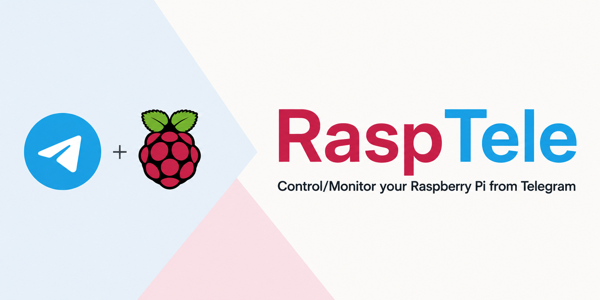

  

# Rasptele

Rasptele is a private Telegram control plane for monitoring and managing a Raspberry Pi Docker server without exposing an inbound port.

Rasptele gives one trusted Telegram account a narrow interface to host health, Docker containers, and Pi-hole v6. It runs as three containers, keeps the Docker socket isolated in an allowlisted guard service, and delivers alerts through outbound Telegram long polling.

  

## What Rasptele does

- Reports CPU, memory, disk, temperature, throttling, and container health with `/status`.
- Lists Docker containers and restarts only explicitly allowlisted names after confirmation.
- Reports Pi-hole v6 statistics and can temporarily disable or immediately restore blocking.
- Sends stateful alerts for host, container, Docker guard, watchdog, and Pi-hole failures.
- Retries unsent Telegram notifications from a durable SQLite outbox.
- Records recent incidents and actions for `/audit`.
- Restricts commands and confirmations to one numeric Telegram user ID in a private chat.

qBittorrent, Jellyfin, Coolify API, and OpenWrt integrations are not implemented.

## Start with Docker Compose

You need a 64-bit Raspberry Pi with Docker Engine and the Docker Compose plugin, a Telegram bot token from `@BotFather`, and your numeric Telegram user ID.

Open the [latest published release](https://github.com/maddhruv/rasptele/releases/latest) and follow the getting-started guide from that same tag. Do not deploy the mutable `main` branch: a release commit can arrive before its matching image finishes publishing.

The stack starts `rasptele`, `docker-guard`, and `rasptele-watchdog`. It publishes no host ports.

## Choose a deployment method

| Method | Image source | Guide |
| --- | --- | --- |
| Docker Compose | Released image from canonical Compose | [Deploy with Docker Compose](docs/deployment.md#deploy-with-docker-compose) |
| Coolify | Same canonical Compose and released image | [Deploy with Coolify](docs/deployment.md#deploy-with-coolify) |
| Portainer | Same canonical Compose and released image | [Deploy with Portainer](docs/deployment.md#deploy-with-portainer) |

## Documentation

- [Deploy your first Rasptele bot](docs/getting-started.md) — newcomer tutorial
- [Deploy and update Rasptele](docs/deployment.md) — deployment how-to guides
- [Configure Rasptele](docs/configuration.md) — configuration reference
- [Operate and troubleshoot Rasptele](docs/operations.md) — operational how-to guides
- [Release Rasptele](docs/releasing.md) — maintainer release process

## Security

Rasptele operates close to the Docker host. The bot has no Docker socket mount; only `docker-guard` holds the socket, and it exposes a small allowlisted API inside the Compose network. Host filesystem mounts are read-only, but they still expose sensitive metadata to the bot container.

Keep the stack on a dedicated, trusted Raspberry Pi. Never publish its internal services. Read the [security policy](SECURITY.md) before deployment and use private vulnerability reporting for suspected security issues.

## Contributing and support

Read [CONTRIBUTING.md](CONTRIBUTING.md) before opening a pull request. Use [SUPPORT.md](SUPPORT.md) to choose the right support channel, and follow the [Code of Conduct](CODE_OF_CONDUCT.md) in all project spaces.

User-visible changes are recorded in [CHANGELOG.md](CHANGELOG.md).

## License

Rasptele is licensed under the [Apache License 2.0](LICENSE).
